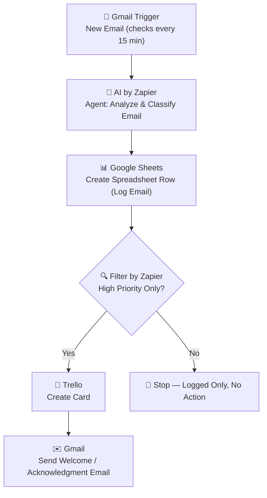

#  AI Email Analyzer & Priority Router

> An AI-powered Zapier automation that reads incoming emails, uses an AI Agent to analyze and classify them, logs every email to a spreadsheet, and automatically routes high-priority emails into a Trello task board with an instant acknowledgment reply — all without manual triage.


---

##  Table of Contents

- [Project Overview](#-project-overview)
- [Workflow Diagram](#-workflow-diagram)
- [Features](#-features)
- [Technologies Used](#-technologies-used)
- [Folder Structure](#-folder-structure)
- [Setup Guide](#-setup-guide)
- [Use Cases](#-use-cases)
- [Screenshots](#-screenshots)
- [Troubleshooting](#-troubleshooting)
- [Best Practices](#-best-practices)
- [Contributing](#-contributing)
- [License](#-license)
- [Author](#-author)

---

##  Project Overview

Manually reading and triaging every incoming email wastes time and creates a real risk of urgent messages getting buried in a crowded inbox. **AI Email Analyzer & Priority Router** solves this by combining Zapier's automation engine with an AI Agent step to intelligently read, understand, and act on every new email automatically.

Every time a new email arrives, the workflow:

1. Detects the new email via Gmail.
2. Sends it to an **AI Agent (AI by Zapier)** for analysis — extracting intent, sentiment, category, and a priority score.
3. Logs a structured record of the email into Google Sheets for tracking and reporting.
4. Filters out anything that isn't high priority.
5. Creates a Trello card for high-priority emails so the right task gets actioned by the team.
6. Sends an automatic welcome/acknowledgment email back to the sender.

The result is a **zero-touch email triage system** — a practical example of how AI + no-code automation can replace a manual inbox-management workflow.

---

##  Workflow Diagram



A full step-by-step breakdown with rationale for each node is available in [`docs/workflow-diagram.md`](docs/workflow-diagram.md).

---

##  Features

- **AI-Powered Email Understanding** — Uses Zapier's built-in AI Agent to read and interpret email content instead of relying on rigid keyword rules.
- **Automatic Prioritization** — Classifies each email so only genuinely urgent items reach the team's task board.
- **Centralized Email Log** — Every email (high or low priority) is recorded in Google Sheets, creating a searchable audit trail.
- **Smart Filtering** — A dedicated filter step ensures downstream actions (Trello + auto-reply) only run for high-priority emails.
- **Instant Task Creation** — High-priority emails become actionable Trello cards automatically, with no manual copy-pasting.
- **Automated Acknowledgment** — Senders of high-priority emails receive an immediate reply, improving responsiveness and customer experience.
- **No-Code, Fully Visual** — Built entirely in Zapier; easy to maintain, extend, or hand off to non-technical teammates.
- **Scalable Design** — Additional filters, branches, or integrations (Slack, CRM, etc.) can be added without restructuring the core flow.

---

##  Technologies Used

| Tool / Service | Role in Workflow |
|---|---|
| **Zapier** | Core automation/orchestration platform |
| **Gmail** | Trigger (new email) and action (sending acknowledgment email) |
| **AI by Zapier (Agent)** | AI-based email analysis, classification, and priority scoring |
| **Google Sheets** | Persistent log of all processed emails |
| **Filter by Zapier** | Conditional logic to isolate high-priority emails |
| **Trello** | Task management board for high-priority items |

---

##  Folder Structure

```
ai-email-analyzer-priority-router/
│
├── README.md                     # Main project documentation (this file)
├── LICENSE                       # MIT License
├── CONTRIBUTING.md               # Guidelines for contributing to this project
│
├── docs/
│   └── workflow-diagram.md       # Detailed step-by-step workflow breakdown
│
└── screenshots/
    └── README.md                 # Index/placeholder for workflow & setup screenshots
```

> **Note:** Since this is a Zapier automation (not a code-based application), the repository is documentation-first. It's structured to clearly showcase design decisions, configuration, and reasoning — the same way a codebase would showcase source files.

---

##  Setup Guide

Follow these steps to recreate this automation in your own Zapier account.

### Prerequisites

- A Zapier account (Professional plan or higher recommended, since AI by Zapier and multi-step Zaps may require paid tiers)
- A connected Gmail account
- A Google Sheets account with a sheet prepared for logging emails
- A Trello account with a board/list dedicated to high-priority tasks

### Step-by-Step Configuration

**1. Trigger — Gmail: New Email**
   - App: `Gmail`
   - Trigger event: `New Email`
   - Polling interval: every 15 minutes
   - Configure the Gmail search filter if you want to limit which emails trigger the Zap (e.g., a specific label or inbox folder).

**2. Action — AI by Zapier: Agent**
   - App: `AI by Zapier`
   - Action event: `Agent` (or equivalent AI action step)
   - Provide a clear prompt instructing the AI to:
     - Summarize the email
     - Classify it by category (e.g., Support, Sales, Urgent, Spam)
     - Assign a priority label (e.g., `High` / `Medium` / `Low`)
   - Map the email subject and body from Step 1 as input variables.

**3. Action — Google Sheets: Create Spreadsheet Row**
   - App: `Google Sheets`
   - Action event: `Create Spreadsheet Row`
   - Select your target spreadsheet and worksheet.
   - Map columns such as: Sender, Subject, Summary (from AI), Category (from AI), Priority (from AI), Timestamp.

**4. Filter — Filter by Zapier: High Priority Only**
   - App: `Filter by Zapier`
   - Condition: Only continue if the AI-generated priority field **equals** `High`.
   - This step stops the Zap for all non-high-priority emails, so no unnecessary Trello cards or replies are created.

**5. Action — Trello: Create Card**
   - App: `Trello`
   - Action event: `Create Card`
   - Select the target board and list (e.g., "Urgent Inbox").
   - Map the card title to the email subject and the card description to the AI-generated summary.

**6. Action — Gmail: Welcome Email (Acknowledgment)**
   - App: `Gmail`
   - Action event: `Send Email`
   - Send a reply to the original sender confirming their message was received and is being handled with priority.
   - Personalize using the sender's name/email pulled from Step 1.

### Testing the Zap

1. Turn the Zap on in Zapier.
2. Send a test email to the connected Gmail account with clearly urgent language.
3. Confirm:
   - A row appears in Google Sheets.
   - A Trello card is created (for high-priority tests).
   - An acknowledgment email is received (for high-priority tests).
4. Send a second, clearly low-priority test email and confirm it is logged but does **not** trigger Trello or the auto-reply.

---

##  Use Cases

- **Customer Support Teams** — Automatically flag and route urgent customer complaints to a support task board.
- **Freelancers & Consultants** — Never miss a high-value client inquiry buried among newsletters and low-priority mail.
- **Sales Teams** — Prioritize hot leads that email in directly, ensuring fast response times.
- **Small Business Owners** — Run a lean, automated front office without hiring dedicated inbox-management staff.
- **Agencies** — Manage multiple client inboxes with consistent, AI-driven triage rules instead of manual review.

---

## Screenshots

Screenshots of the live Zap configuration, AI Agent prompt setup, and sample outputs (Google Sheets log, Trello card, and acknowledgment email) are organized in the [`screenshots/`](screenshots/) folder.

| Screenshot | Description |
|---|---|
| `01-zap-overview.png` | Full 6-step Zap overview in Zapier |
| `02-ai-agent-config.png` | AI by Zapier Agent step configuration |
| `03-google-sheets-log.png` | Sample logged data in Google Sheets |
| `04-filter-condition.png` | Filter by Zapier condition setup |
| `05-trello-card.png` | Example auto-created Trello card |
| `06-acknowledgment-email.png` | Sample auto-sent acknowledgment email |

> Add your actual screenshots to the `screenshots/` folder using the filenames above, or update the table to match your naming convention.

---

##  Troubleshooting

| Issue | Likely Cause | Solution |
|---|---|---|
| Zap doesn't trigger on new emails | Gmail trigger polling delay, or email doesn't match search filter | Wait for the next 15-minute poll cycle; verify Gmail search filter settings |
| AI Agent returns inconsistent priority labels | Prompt is too vague or lacks clear categories | Refine the AI prompt with explicit priority definitions and examples |
| Google Sheets row is created but fields are blank | Incorrect field mapping from AI step output | Re-check the mapped output fields from the AI by Zapier step |
| Filter step blocks everything, even urgent emails | Filter condition value doesn't exactly match AI output (case sensitivity, extra spaces) | Standardize AI output format (e.g., force exact values like `High`, `Medium`, `Low`) |
| Trello card is created but missing details | Data not mapped from prior steps | Verify field mapping between the AI Agent/Google Sheets steps and the Trello action |
| Acknowledgment email fails to send | Gmail authentication expired or sender field not mapped | Reconnect the Gmail account in Zapier and confirm the "To" field mapping |
| Zap runs are consumed too quickly | Polling interval too frequent for your plan's task quota | Adjust trigger frequency or upgrade Zapier plan tier |

---

##  Best Practices

- **Write specific AI prompts.** The more precisely you define categories and priority levels in the AI Agent prompt, the more consistent the classification will be.
- **Standardize output values.** Force the AI to return fixed values (e.g., exactly `High`, `Medium`, `Low`) so the Filter step works reliably.
- **Log everything, act on priority only.** Keeping a full log in Google Sheets (even for low-priority emails) preserves visibility without cluttering your task board.
- **Test with edge cases.** Try ambiguous, spammy, and multi-topic emails to confirm the AI Agent classifies them sensibly.
- **Version your Zap.** Use Zapier's built-in version history before making major changes, so you can roll back if something breaks.
- **Monitor task usage.** AI steps and multi-step Zaps consume more tasks — keep an eye on your Zapier plan's monthly task limit.
- **Keep human oversight.** Periodically review the Google Sheets log to confirm the AI's priority calls match your actual expectations, and refine the prompt over time.

---

##  Contributing

Contributions, suggestions, and improvements are welcome! Please see [CONTRIBUTING.md](CONTRIBUTING.md) for guidelines on how to propose changes, report issues, or suggest new features for this automation.

---

## License

This project is licensed under the [MIT License](LICENSE) — feel free to use, modify, and adapt this workflow for your own projects.

---
Author

AI smart galaxy (https://aismartgalaxy.com/)
Automation Builder | Zapier & AI-Powered Workflow Enthusiast

This project is part of an ongoing portfolio of no-code and AI-powered automation projects, showcasing practical business use cases built with Zapier — from beginner-level integrations to advanced, AI-driven, multi-step workflows.

 Open to freelance automation projects and collaborations
- 🔗 Feel free to connect for questions, feedback, or automation consulting

---

 **If you found this project useful or inspiring, consider starring the repository!**
